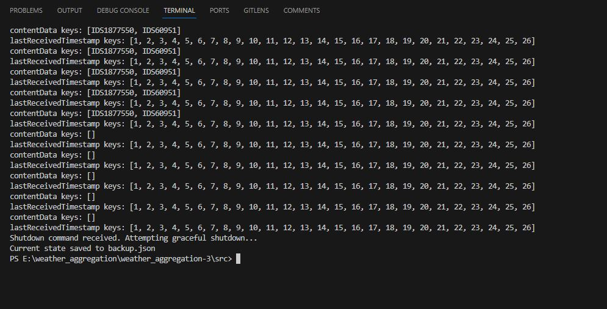

# Weather Aggregation System

Weather Aggregation System is a simulated project designed to aggregate weather data from multiple content servers, order the data using the Lamport clock, and serve the most recent data to clients upon request.

## Table of Contents
- [Overview](#overview)
- [File Breakdown](#file-breakdown)
- [Key Features](#key-features)
- [Lamport Clock - Deep Dive](#lamport-clock---deep-dive)
- [Testing](#testing)
- [Planning on Testing](#planning-on-testing)

## Overview
This project consists of multiple content servers sending data to an aggregation server. The aggregation server uses a Lamport clock to order the received data and serves the most recent data to clients upon a GET request.

## System Architecture

The system's architecture is divided into the following main components:

1. **Aggregation Server**: Central server responsible for aggregating data from multiple content servers.
2. **Content Server**: Reads weather data from files, processes it, and sends it to the Aggregation Server.
3. **GET Client**: Connects to the Aggregation Server to retrieve and display weather data.

## File Breakdown

### `GETClient.java`
- Represents a client that sends GET requests.
- Fetches and prints the most recent weather data from the `AggregationServer`.

- GETClient Recieved latest data from the Aggregation Server. The Aggregation serrver check the ID and send the updated data of that specific ID to the GETClient.

The GET Client is a user interface for retrieving aggregated weather data from the Aggregation Server. Users can specify the ID of the data they wish to access, and the client will fetch and display the corresponding data. It employs a Lamport Clock to synchronize data retrieval actions in the distributed system.

Features:

User-specified data ID for retrieval
Lamport Clock for synchronized data access
Socket communication with the Aggregation Server
Data display and formatting

### `ContentServer.java`
- Represents a content server.
- Sends weather data and a Lamport clock value to the `AggregationServer` via PUT requests.

The Content Server reads, processes, and sends weather data files to the Aggregation Server at regular intervals. Each Content Server instance handles specific data files and employs a Lamport Clock to manage logical timestamps.

Features:

Regular data sending at specified intervals
Lamport Clock for maintaining logical timestamps
Handles multiple data files
Data parsing and conversion to JSON format
Socket communication with the Aggregation Server

### `AggregationServer.java`
- Handles incoming PUT and GET requests.
- Uses a Lamport clock to order the received data.
- Has a shutdown hook to backup the most recent data when interrupted.

- Data is being reomoved from the Aggregation server every after 30 seconds.

The Aggregation Server is a central component that aggregates and manages weather data received from various Content Servers. It utilizes both HTTP and Socket servers to handle incoming data and requests. It's also equipped with a Lamport Clock to manage logical clock timestamps in the distributed system, ensuring that data is processed and stored in a synchronized manner.

Features:

HTTP server to serve GET requests
Socket server to receive weather data from Content Servers
Concurrent handling of multiple data sources
Lamport Clock for maintaining logical timestamps
Data filtering based on IDs
Auto-removal of stale data
Graceful shutdown and state backup

### `Modify.java`

Modify is a utility component that performs regular modifications to the weather data files to simulate real-time data changes. It adjusts various data attributes like air temperature, wind speed, ID, and date-time to reflect dynamic weather conditions.

Features:

Regular data modification at specified intervals
Dynamic changes to weather attributes
Date and time increment
ID adjustments for data diversity
File reading and writing operations

### `LamportClock.java`
- A class for the Lamport logical clock.
- Helps in ordering events in the distributed system.

## Usage

Compiling
-make compile

Running the Aggregation Server
-make run-aggregation <HTTP_PORT> <SOCKET_PORT>

Running the Content Server
-make run-content <AGGREGATION_SERVER_SOCKET_PORT> <DATA_FILE_PATHS>

Running Modify
-make run-modify

Running the GET Client
-make run-getclient <AGGREGATION_SERVER_SOCKET_PORT> <DATA_ID>

## Key Features

### HTTP Protocol
The system adopts a simplified version of the HTTP protocol for communication. Content servers utilize PUT requests to transmit data, and clients use GET requests to retrieve the latest information. 

- As the Aggregation Server removes the weather data after each 30 seconds thats why it's not visible on the web.

### Lamport Clock Sync and Implementation
The system employs Lamport clocks to logically order events in a distributed environment, avoiding complications arising from unsynchronized system clocks across different servers.

### Testing 
Utilize the provided Makefile commands to initiate the `AggregationServer`, multiple `ContentServer` instances, and the `GETClient`. Observe the `GETClient` terminal to confirm the retrieval of the latest data based on Lamport clock order.

## Lamport Clock - Deep Dive
A mechanism to order events logically in a distributed system without the need for synchronized physical clocks. It ensures a consistent order of events across all participating entities.

## Testing

### Initial Tests
- Initiate the aggregation server and multiple content servers.
- Observe the data processing and ordering by the aggregation server.
- Use a GET client to fetch and verify the latest data.

### Lamport Clock Testing
- Introduce delays in some content servers and observe how the Lamport clock maintains the logical order.

### Backup Testing
- Interrupt the aggregation server and check if the `backup.json` file is created with the recent data.

- A backup file called backup.json is created and stores the recent data when the aggregation server crashed or forcefully shutdown.

### Fault Tolerance
- Test the system’s ability to exclude data from servers that haven't updated within a specified period.

## Planning on Testing
1. **Unit Tests**: Ensure each module functions as intended individually.
2. **Integration Tests**: Test the system’s overall functionality and the interaction between different modules.
3. **Performance Testing**: Evaluate the system’s performance, focusing on response times and data accuracy.

## Testing Results
1.  

2. 

3. 

4. 

## Conclusion
The Weather Data Aggregation System is a multi-component solution designed for efficient and synchronized handling, aggregation, modification, and retrieval of weather data in a distributed environment. Each component is crafted with specific functionalities to ensure real-time data processing and access with logical timestamp management via the Lamport Clock.

